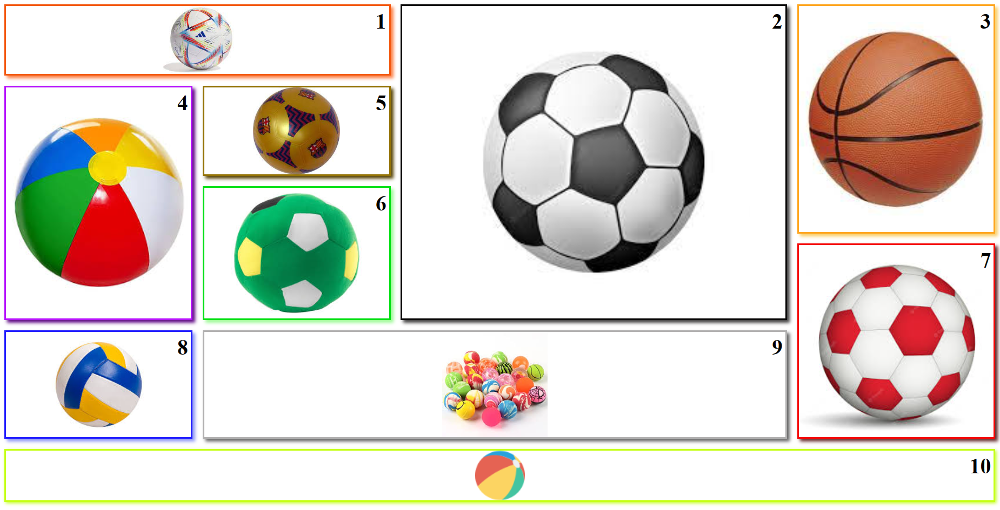

# Galeria de imágenes con grid
Probando grid, se me ocurrió la idea de crear una galeria de imágenes y al pasar el raton por encima tienen animaciones.
Creo que el grid tiene un gran potencial que hay que explotar al máximo.
Utilizo los comandos de git: add, commit, push.... y creo un fork desde otra cuenta
de otro grupo y hago el commit "Cambiado el punto 10" desde la otra cuenta
## Screenshot

## GitHub flow
1. empleado entorno de trabajo remoto
2. yo desde mi perfil personal https://github.com/geannyna/maquetacion_grid/forks y yo desde Hack-Part-Time-4
3. añadir otros archivos, codigo modificado o codigo añadido
4. git init, git add -A, git commit -m, git remote, git push, git branch y git checkout o switch
5. commit, pull request y merge pull request
